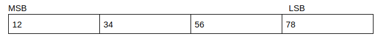

# Hiding a file in an image

In command line: binwalk&#x20;

Or change .jpg to .zip

hex editor:

* `xxd`
* `hexyl`
* `hexedit`
* `ghex`

Another method is open up the image in hex editor and start looking around for something odd (You may find the flag itself from the dump at this point, but for the sake of example try extracting it). Near the bottom of the file you should see the terminating byte of a jpg `ffd9`:

`01e17a0: 685c 7fab 8eb4 5b32 61f1 c4ff d950 4b03 h\....[2a....PK.`

Another important part of this line is the `PK` near the end. `PK` are the initials of Phil Katz, the inventor of the zip file, and indicate that a zip file starts at that point.

Using this information we can use another handy linux tool, [`dd`](http://en.wikipedia.org/wiki/Dd\_\(Unix)). The `dd` command is very versatile and allows for the copying and converting of a multitude of files. In our case, we are going to be using it to extract the zip file.

#### IEND[¶](https://ctf-wiki.mahaloz.re/misc/picture/png/#iend) 

IEND (Image Trailer Chunk): It is used to mark the end of a PNG data stream or file, and it must be placed at the end of the file.

**Example**[**¶**](https://ctf-wiki.mahaloz.re/misc/picture/png/#example)

* IEND's chunk length is always `00 00 00 00`
* IEND's chunk type is always IEND `49 45 4E 44`
* IEND'S CRC value is always `AE 42 60 82`

That means a PNG file will always end with these bytes:

`00 00 00 00 49 45 4E 44 AE 42 60 82`

`pngcheck` check info about png

<figure><figcaption></figcaption></figure>

#### Steghide

useful tools to find hidden things in images

