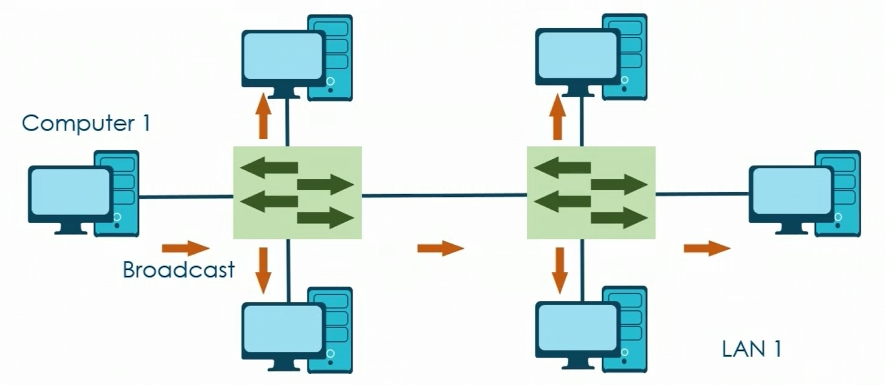
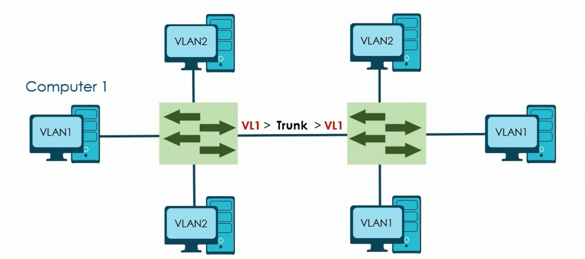
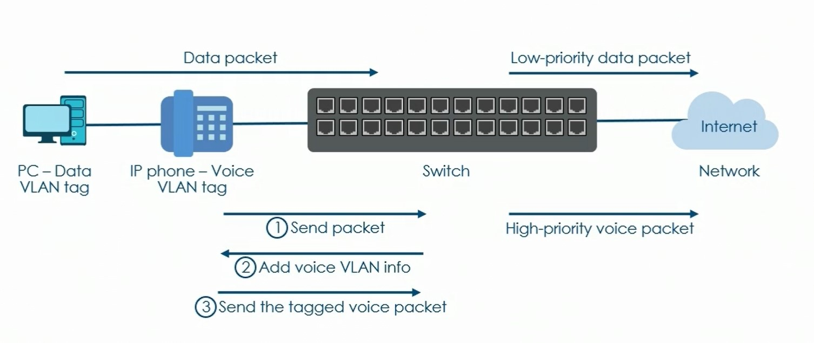
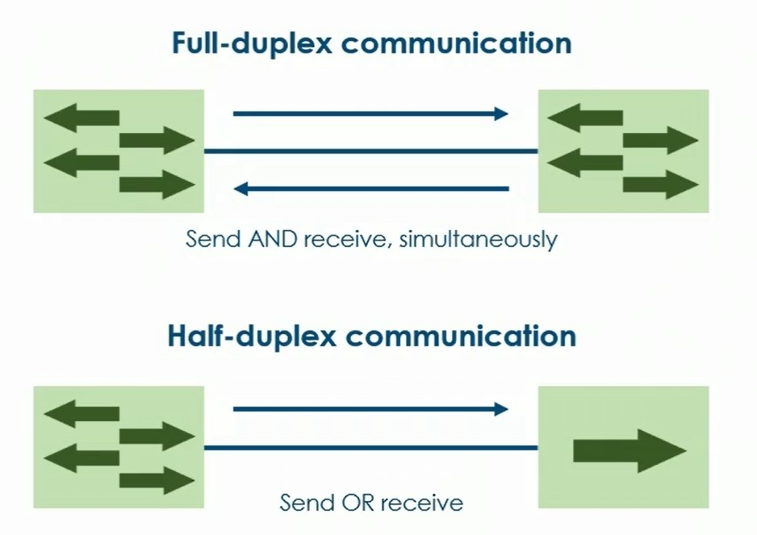
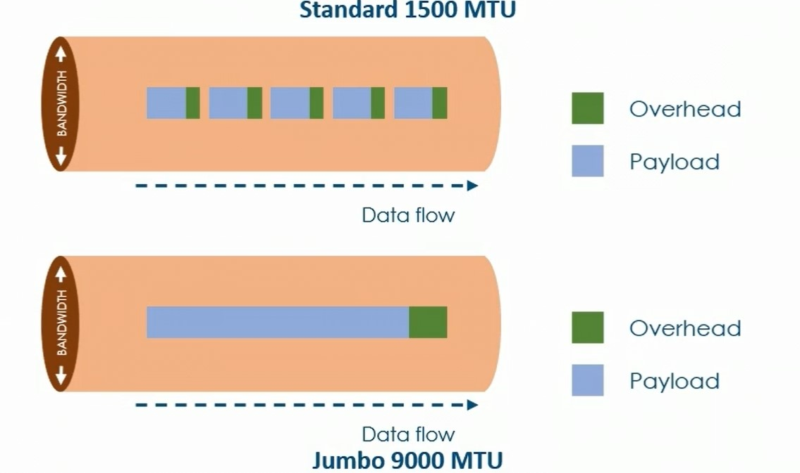
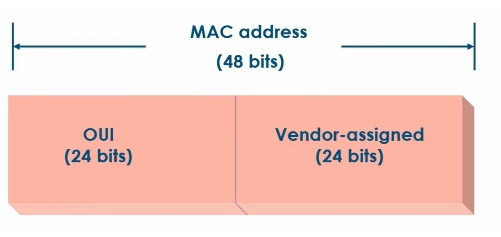
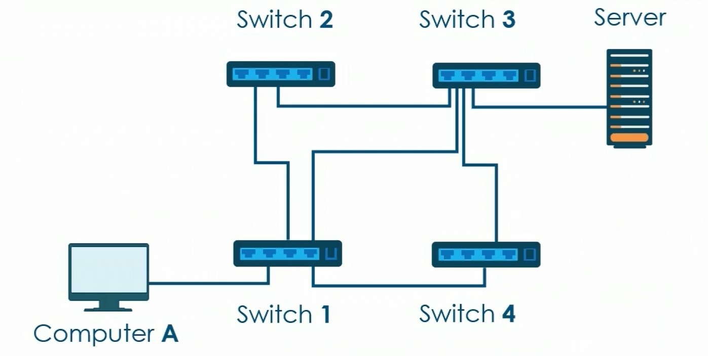
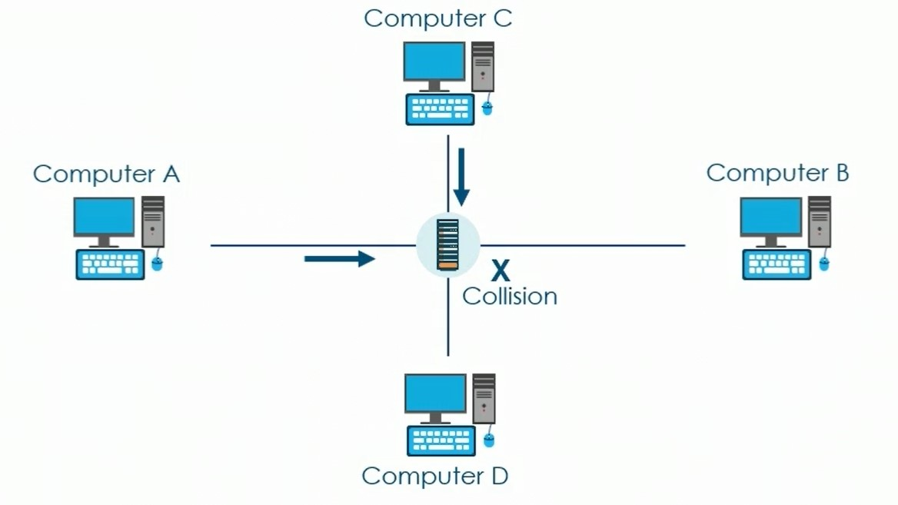
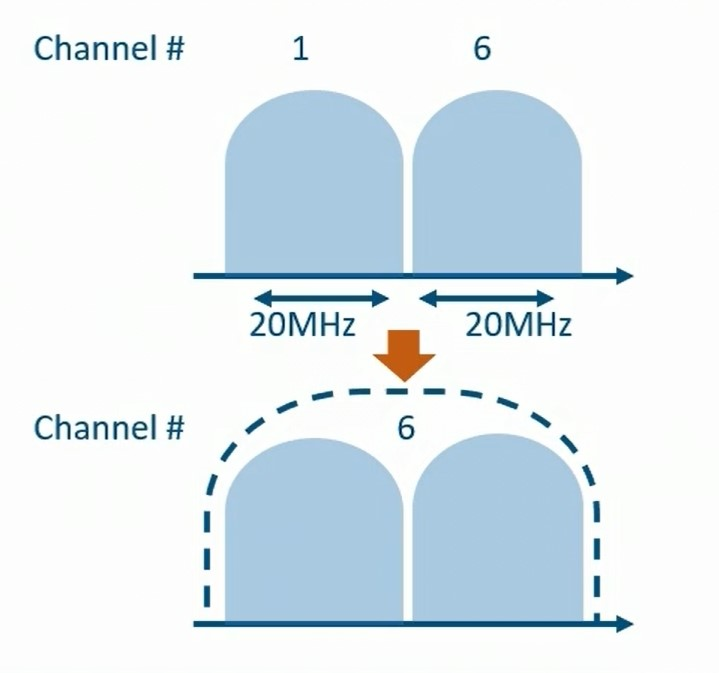
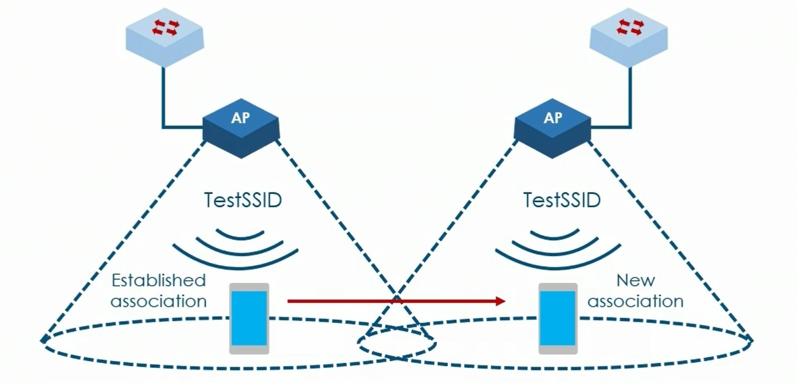

# Ethernet Switching & Wireless Standards

## Data Virtual Local Area Network

### VLAN Virtual Local Area Network

* Logical grouping of devices

**Benefits:**

* Cost-effective solution
* Reduces administrative overhead

&#x20;**VLAN Characteristics**

* Increase the number of broadcast domains
* Reduce security risks
* Improve performance
* Design more flexible networks
* Change network configurations easily

**LAN Topology**

<figure><figcaption></figcaption></figure>

**VLAN Configuration**

<figure><figcaption></figcaption></figure>

**VLAN Membership**

* Static
* Dynamic

**VLAN Connections**

* Access link - computer to switch
* Trunk link - switch to switch

**Trunk Tagging**

* Identifies VLAN membership across multiple switches

<figure><figcaption></figcaption></figure>

## Voice VLAN Configurations

* Allocated for VoIP systems

<figure><figcaption></figcaption></figure>

**Benefits**

* Ensures VoIP devices are not impeded
* Prioritizes voice services
* Simplifies network configuration

**Voice VLAN Modes**

* Normal mode
* Security mode

## Ethernet Switching Port Configuration

### Duplex Communication

* Traffic can travel in both directions

**Full-duplex communication**

* Send and receive at the same time

**Half-duplex communication**

* Send or receive

<figure><figcaption></figcaption></figure>

### Link Aggregation Control Protocol (LACP)

* Combine the bandwidth of multiple physical ports into a single logical port
* Increased reliability
* Physical resource allocation
* Improved bandwidth
* Cost-effective

### Port Aggregation Protocol (PAgP)

* Three configuration
  * Auto (passive)
  * Desirable (active)
  * On

### Flow Control

* Reduces packet loss

### Port Mirroring

* Used for diagnosing errors

### Port Security

* Prevents unknown devices from forwarding packets

### Jumbo Frames

<figure><figcaption></figcaption></figure>

### Ethernet Interfaces

* MDI (Medium Dependent Interface)
* MDIX (Crossover)
* Auto-MDI/MDIX

## Media Access Control Address Tables

### MAC Addresses

* A media access control (MAC) address is 48-bit long, represented by 12 hexadecimal characters, and coded into the network interface upon manufacture
* Example MAC address: 00:AA:19:9A:58:B4

<figure><figcaption></figcaption></figure>

OUI (Organizationally Unique Identifier) - allocated to a particular vendor or manufacturer by the IEEE (Institute of Electrical and Electronics Engineers)

**MAC Address Operation**

* Resides in the Data Link 2 layer&#x20;
  * LLC Sublayer (Logical Link Control)
  * MAC Sublayer

## Power over Ethernet

* Enables network cables to carry electrical power

**Common Devices:**

* VoIP phones
* Wireless devices
* IP cameras

**Benefits**

* Cost savings
* Reliability
* Scalability
* Flexibility

**Limitations**

* Power delivery rates
* Transmission distance
* Device compatibility

**Distances**

* 100 to 1000+ meters thats just the data
* The power can actually go a lot father than that

**Specifications**

* PoE - Voice over IP phone, some kind of a sensor or a meter or a Wireless Access Point
* PoE+ - Required for camera that also moves
* PoE++ - would be for a devices that really do draw a lot of power, such as a complex video conferencing system or various other building management devices

Only main difference here is the amount of power that is going to be required for the device and/or what the specifications call for.

## Spanning Tree Protocol (STP)

* Protocol used to prevent switching/ bringing loops
* Works at the data link layer where switches and bridges operate

**Looping**

* Ethernet frames circulating the network without reaching their destination

**Looping example:**

<figure><figcaption></figcaption></figure>

**Advantages**

* Simple to use
* Wide support
* Redundancy
* Proven technology
* Familiar

**Disadvantages**

* I/O limitations
* Widespread failure

STP is being replaced through different architectures in data centers and the use of features such as Link Aggregation Protocol

## CSMA/CD Media Access Control Methods

* Carrier sense multiple access/collision detection

**Collision Detection (CD)**

* Regulates communication

**CSMA/CD Components**

* Carrier sense (CS)
* Medium access (MA)
* Collision detection (CD)

**CSMA/CD Process**

<figure><figcaption></figcaption></figure>

**Protocols**

* CSMA/CD
* CSMA/CA (Collision avoidance)

## Address Resolution Protocol (ARP)

* Resolves IP address to MAC (Media Access Control) address
* Works between layers 2 and 3
  * MAC address = Layer 2
  * IP address = Layer 3

**Advantages of ARP**

* End node discovery
* Easily identify MAC addresses

**Disadvantages of ARP**

* Prone to malicious activity

**ARP Attacks**

* Man-in-the-middle attacks
* Denial-of-service attacks
* Session hijacking

## Neighbor Discovery Protocol (NDP)

* Used in conjuction with IPv6
* Responsible for the resolution of IPv6 addresses into valid MAC addresses
* Addresses are stored in neighbor cache

**Neighbor Cache**

* Devices using NDP manage their own neighbor cache

**NDP Cache Components**

* Destination cache
* Default router list
* Prefix cache

**NDP Additional Functionality**

* Detecting duplicate addresses
* Verifying host relevance
* Router and prefix detection
* Determining transmission parameters
* Redirect options

## 802.11 Standards and Technologies

In February of 1980 => 802

**IEEE 802.11**

* Transmission speed of 1-2 Mbps over 2.4 GHz frequency&#x20;

**IEEE 802.11a**

* Speeds of up to 54 Mbps over 5 GHz frequency

**IEEE 802.11b**

* 11 Mbps
* Backward compatible with 802.11
* 2.4 GHz

**IEEE 802.11g**

* 54 Mbps
* 2.4 GHz

**IEEE 802.11ac**

* Speeds from 433 Mbps to 1.3 Gbps

**IEEE 802.11ax**

* WiFi 6
* Next generation standard in WiFi technology
* Referred to also as AX WiFi
* Greater speeds and stability
* Up to 14 Gbps

## Wireless Frequencies and Ranges

**WiFi Frequencies**

### **2.4 GHz**

**Speed**

* Maximum speed of 450 to 600 Mbps

**Range**

* 150 feet indoors and 300 feet outdoors

**Considerations**

**Pros**

* Larger coverage area
* Better penetrating objects
  * Concrete
    * Wood

**Cons**

* Lower data rates
* Prone to interference
* Can become overcrowded

### **5 GHz**

**Speed**

* Maximum speed of 1300 Mbps

**Channels**

* Multiple non-overlapping channels

**Benefits**

* Higher speeds
* Clearer signal
* Not as susceptible to interference

**Disadvantages**

* Shorter range
* Compatibility

## Common Wi-Fi Channels

### WiFi Channels

* 2.4 GHz = 11 WiFi channels
* 5 GHz = 45 WiFi channels

### Channel Designations

#### WiFi Channels

* USA = channels 1-11
* Europe = channels 1-13
* Japan = 1-14

<figure><figcaption></figcaption></figure>

* Each channel spans a range of 22 MHz on the entire spectrum

#### Channel Width

Channel width affects these values:

* Speed
* Volume of data

#### Channel Configuration

* Automatic
* Manual

## Wireless Channel Bonding

### Channel Bonding

* Common in IEEE 802.11
* Used to combine different channels
* Increases throughput

<figure><figcaption></figcaption></figure>

#### Channel Bonding Popularity

* Introduced with 802.11n
* Provides additional functionality and increased throughput

#### 2.4 GHz Frequency Band

**3 non-overlapping channels**

* Total width of approximately 70 MHz (channels 1 through 11)
* Only a single bounded pair of 40 MHz can be configured (channels 1 and 6)
* Only a single non-overlapping channels would remain (channel 11)

#### 5 GHz Frequency Band

**25 non-overlapping channels**

* Total width of over 500 MHz
* Many more bonded pairs can be configures
  * Up to 160 MHz in 802.11 ac
  * Very high throughput

## Service Set Identifier (SSID)

* Used to uniquely name a wireless local area network (WLAN)

#### Basic Service Set (BSS)

* Used to form one logical WLAN segment

#### Extended Service Set (ESS)

* One or more interconnected Basic Service Sets (BSS)
  * One Access Point
  * One Station

#### WiFi Roaming

<figure><figcaption></figcaption></figure>

#### Independent Basic Service Set (Ad Hoc)

* Simplest IEEE 802.11 network

#### Difference between Infrastructure mode and Ad Hoc mode:

**Infrastructure mode:**

* Much more common
* Wireless router that provides connectivity to all devices and also provides you access to the Internet
* All of the devices, when communicating go through that wireless router

**Ad-Hoc mode:**

* Allows do both
* Devices can go through the central router, but they are also allowed to set up direct connections with each other

## Wireless Antenna Types

## Wireless Encryption Solutions

## Common Cellular Technologies

## MU-MIMO Technology

## Test

