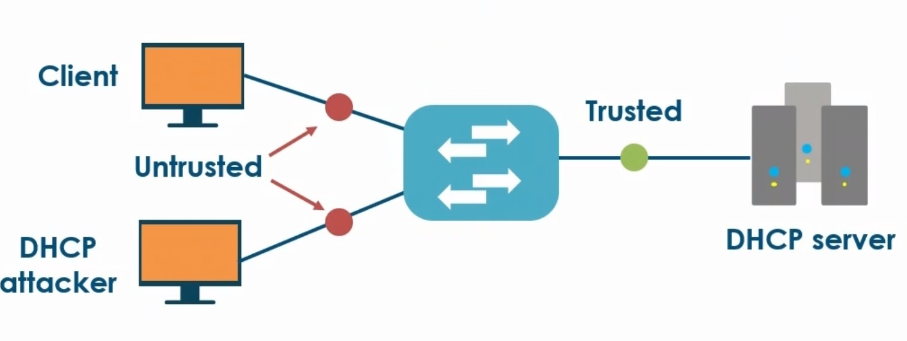
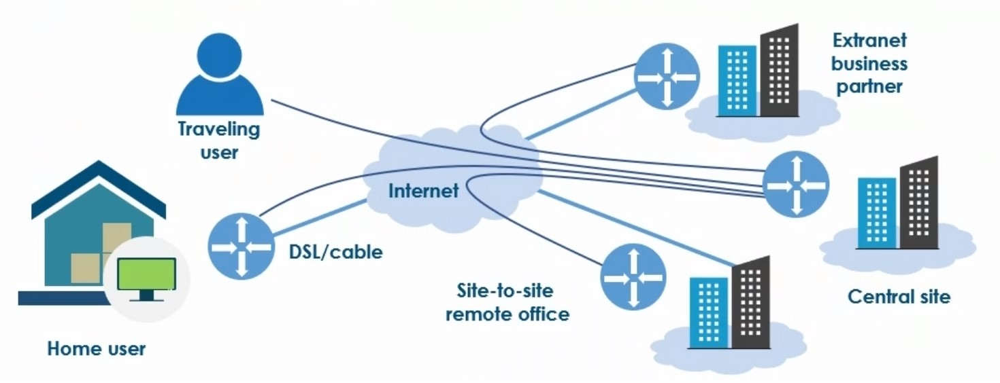
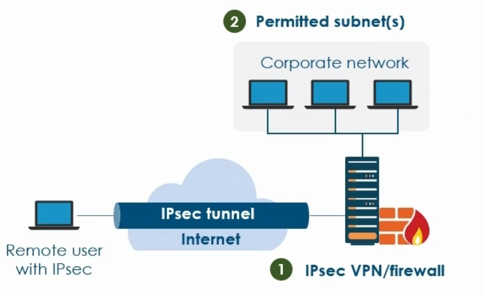
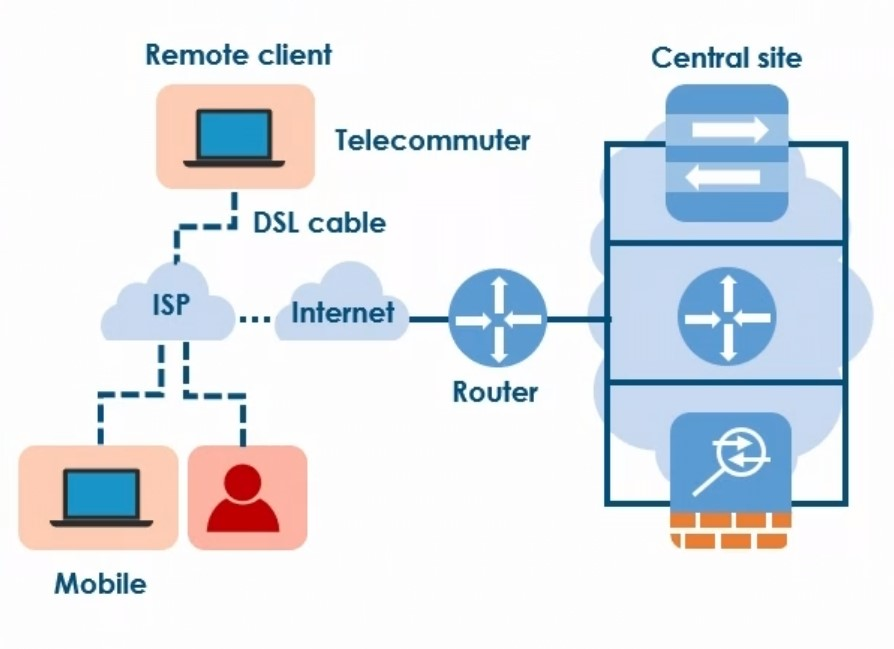
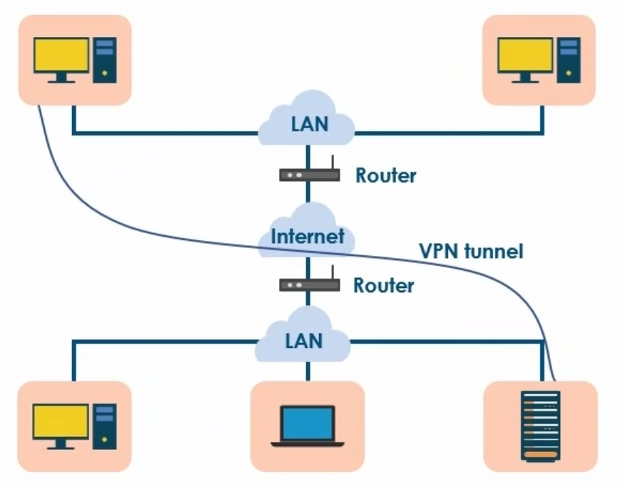
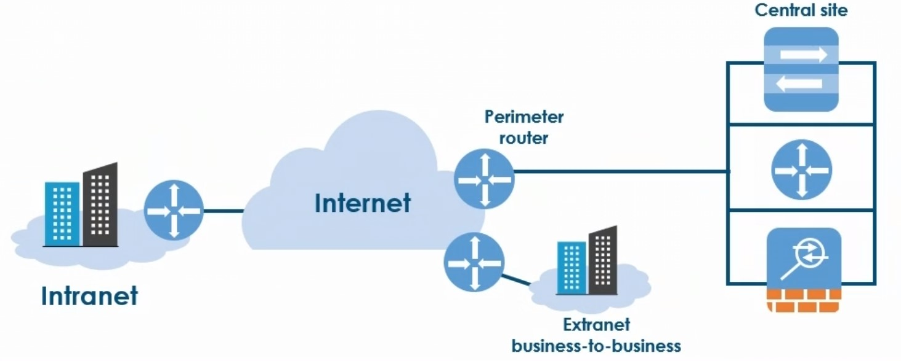
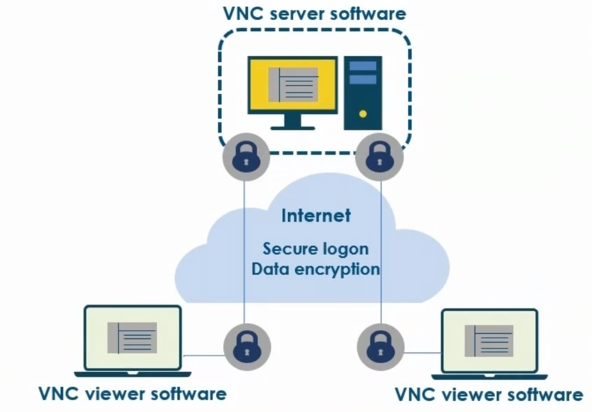
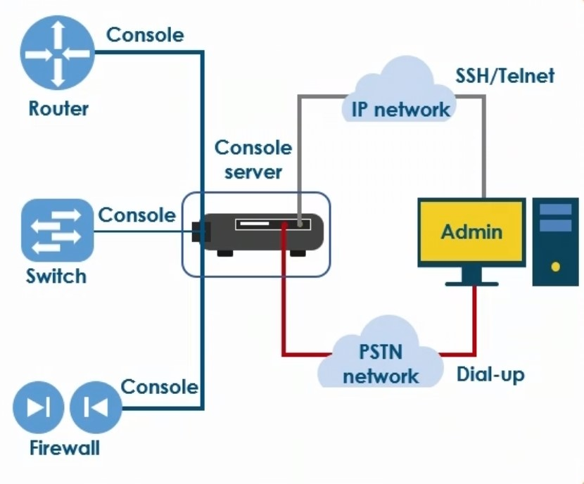

# Physical Security & Network Hardening

## Network Hardening Techniques

### SNMP

* SNMPv1 is inherently insecure, with passwords being passed in plaintext
  * For general monitoring network environment
* SNMPv2 is better, but still has issues
* SNMPv3 was designed explicitly to tackle security issues

### Router Advertisement Guard

* Used to filter router advertisements

### Dynamic ARP Inspection

* Performs validation of Address Resolution Protocol (ARP) packets

### Port Security

* Disable access to unused physical ports
  * Conference rooms
  * Break rooms

### Control Plane Policing

* Protects against denial of service (DoS) and reconnaissance attacks

### Private VLANs

* Primary
* Community
* Isolated

### Default VLAN

* Avoid using default VLAN for network data

### System Services

* Most operating systems contain more enabled services than required by default
* Poses a potential security vulnerability
* Disable all unnecessary services

### DHCP Snooping

<figure><figcaption></figcaption></figure>

* DHCP snooping can be enabled on switches also like Router Advertisement Guard to prevent clients from accepting DHCP offers from any servers other than those that are authorized

### Patching

* Vulnerabilities are discovered over time
* Patching fixes security and stability problems
* Monitor patch deployment
* Monitor compliance
* Inject patches to OS images
* Ongoing tasks

### Access Control Lists

* Permit
* Deny

## Credentials and Strong Passwords

### Passwords

* Have been proven to be one of the main security vulnerabilities
* People often use simple passwords

### Rules

**Pros:**

* Use combination of characters (uppercase, lowercase and special characters)
* Use longer passwords
* Update passwords on a regular basis
* Use different passwords for different accounts
* Use Multifactor Authentication
* Use password management tools

**Cons:**

* Avoid using personal information (nothing that relates to your family)
* Avoid easily recognizable numbers (address, phone number)
* Avoid using real words
* Avoid writting down password
* Do not save passwords in the browser&#x20;

## Disabling Unused Ports

* Unused ports that are left open can present a security vulnerability
  * Network-based attack
* Ports can be blocked using a firewall
  * Network-based
  * Host-based
    * Windows Firewall

### Windows Firewall

* Used to manage the way your computer communicates on the network
  * Inbound rules
  * Outbound rules
  * Connection security rules
  * Monitoring

### Disabling Unused Ports

* Unused router or switch ports
  * Disable to prevent users from accessing the network (prevent someone from connecting a laptop to any open RJ45 jack on the premises)

### Device Ports - Physical

* Many routers offer the capability to manage physical ports on the device
* Good practice to disable these ports to prevent a rogue user plugging directly into the router device
  * Prevent network access

### Device Ports - Virtual

* Used in TCP and UDP
  * Identify unique end-to-end connections
* Port numbers
  * Each side of connection has its own port number
    * Does not change

## Common Firewall Rules

### Firewall Rule Actions

* Allow
* Deny
* Bypass
* Force Allow
* Log Only

### Firewall Rules Format

* Port
* Source
* Destination
* Protocol
* Permission

### Allow Rules

* Permit/Allow
* Implicitly deny (default position) anything that is not specifically trusted will be blocked

### Firewall Configuration

* Implicit (default actions) - to mistrust any type of traffic that is not explicitly allowed
* Explicit - anything that is explicitly defined will override anything that is implicitly there already

## WPA and WPA2 Wireless Security

### Wired Equivalent Privacy (WEP)

* Older encryption algorithm
* Secures data across a wireless network
* WEP key
  * "Password" for the network
  * Must match on all devices communicating on a wireless network

**Advantages:**

* Interoperability
  * Useful when connecting older devices

**Disadvantages:**

* Can be cracked
* Changing the master key can be tedious

### Wi-Fi Protected Access (WPA)

* Security enhancement over WEP

**Advantages:**

* Stronger encryption than WEP
* Uses Temporal Key Integrity Protocol (TKIP)
* Dynamic key changes if necessary

**Disadvantages:**

* Incompatible with some legacy hardware or older operating systems

### Wi-Fi Protected Access 2 (WPA2)

* Signigicantly more secure than WPA
* Uses Advanced Encryption Standard (AES) for encryption
* Two edition:
  * Personal
  * Enterprise

**Benefits:**

* Compatibility
  * However, older equipment may not support it
* Security
  * More advanced encryption (AES)
* TKIP for interoperability with WPA
* Virtually impossible to crack without network access

## TKIP-RC4 and AES-CCMP Wireless Security

### Temporal Key Integrity Protocol (TKIP)

* Encryption protocol
  * Included as part of the IEEE 802.11i standard
* Designed to improve security for WEP
* Encryption method used WPA

### TKIP-RC4

* Suite of algorithms that allows legacy WLAN equipment to upgrade to TKIP without replacing any hardware
* Uses WEP programming
  * Additional code is wrapped at both the beginning and end to modify and encapsulate it
* RC4 stream encryption is used as its basis
* Data packets are encrypted with a unique encryption key
  * Keys are stronger than previous ones
* TKIP uses four algorithms to increase key strength
  * Cryptographic message
  * Initialization-vector sequencing mechanism
  * Per-keying mechanism
    * Provides key generation every 10,000 packets

### TKIP Considerations

* Does not address all security issues for WLANs
  * May not be sufficient for certain data transmissions
    * Government
    * Sensitive corporate

### AES-Counter Mode CBC-MAC Protocol (AES-CCMP)

* Encryption algorithm used in 802.11i
* AES is standard encryption protocol that is used with WPA&#x20;

## Wireless Authentication and Authorization

### Extensible Authentication Protocol (EAP)

* Used to handle and define authentication requests

### Protected Extensible Authentication Protocol (PEAP)

* Version of EAP used in
  * Wireless networks
  * Point-to-point connections
* Enables secure authentication for WLANs that support 802.1 X port access control
* Authenticates with a server using public key certificates
* Authentication is transmitted in a secure TLS session

### Flexible Authentication via Secure Tunneling (EAP-FAST)

* Developed by Cisco
  * Widely adopted as a wireless authentication protocol
* Version of EAP that performs session authentication in
  * Wireless networks
  * Point-to-point connections
* Designed to replace Lightweight Extensible Authentication Protocol (LEAP)

### EAP-TLS

* EAP is used to support multiple authentication methods
* TLS provides
  * Mutual authentication
  * Authentication server certificate
  * Client certificate

### Shared or Open

* **Shared key authentication:**
  * WEP keys are used for successful authentication
  * Client key and access point key must match
  * WEP key can be exposed during authentication process
* **Open System authentication:**
  * No authentication
  * Client is automatically authenticated and connected

### Pre-shared Key (PSK)

* Client authentication method

### MAC Filtering

* MAC filtering is commonly used in WLANs for extra security
* MAC filtering uses a list of authorized MAC addresses to allow connectivity, and will prevent unauthorized devices from connecting

### Captive Portals

* Hotel lobbies
* Coffee shops
* Airports

## Geofencing Technology

### Geofencing

* Used to define geographical boundaries using
  * Global Positioning System (GPS)
  * Radio Frequency Identification (RFID)
  * Cellular
  * Wi-Fi
* Triggers are used that issue alerts when a device enters or exits the boundaries
* Boundaries are generally defined using web-based maps or satellite images

### Virtual Barriers

* Active - involves logging into a location server and/or keeping a mobile app open
* Passive - it's not up to the user, it's always on

### Applications

* User managemenet
* Device managemenet
* Deliveries
* Law enforcement
* Home automation or vehicle management

## Wireless Security Considerations

### Access Point Power

* Ensure signals are not broadcasting too far

### Access Point Placement

* Consider both performance and security

### Wireless Client Isolation

* Feature designed to prevent wireless clients from communicating with each other
* Ideal for guests or users with personally owned devices
* MAC address restrictions

### Wireless Security

* Guest networks
* Configured separately

## IoT Security Considerations

### Internet of Things (IoT)

* Collection of devices that can connect to the Internet

### Mobile Devices

* Use biometrics
* Impose app restrictions
* Segregate data

### Encryption

* Data in transit
* Data at rest

### Credentials

* Require strong passwords

### Antivirus

* Protect data and systems from malware
* Update virus signatures frequently to ensure device security

### Software Updates

* Vendor updates
  * Ensure vendor updates are applied in timely manner
  * Where possible, enable automatic updates to ease administrative burden

### Disable Unused Features

* Reduce attack surface by disabling unused features

## Virtual Private Networks (VPN)

* Provides secure connectivity across unsecure network domains using encryption

<figure><figcaption></figcaption></figure>

### VPN Use Cases

* Access a business network remotely

### Internet Protocol Security (IPsec)

* More commonly use in Windows, but not necessarily supported by other platforms
* Set of protocols used to secure network communication
* Protects data exchanged between an IPsec gateway and any remote host

<figure><figcaption></figcaption></figure>

* Authentication Header (AH)
  * Authenticates the identity of the user or device
* Encapsulating Security Payload (ESP)
  * Encrypts data

### Secure Protocols

* Secure Sockets Layer (SSL)
* Transport Layer Security (TLS)
* Datagram Transport Layer Security (DTLS)

### Host-to-site VPNs

* Used for remote user access
* Connect a user and a corporate local area network (LAN)
  * Remote user initiates the connection only when needed

<figure><figcaption></figcaption></figure>

### Host-to-host VPN

* VPN tunnel is used to connect two hosts
* Users must authenticate prior to data transmission
* Ensures
  * Data authenticity
  * Data integrity
  * Data confidentiality

<figure><figcaption></figcaption></figure>

### Site-to-site VPNs

<figure><figcaption></figcaption></figure>

* More persistent connection is established and maintained
  * Requires a concentrator at each site

**Types of Site-to-site VPNs:**

* Intranet-based
* Extranet-based

## Remote Desktop Protocol (RDP)

* Proprietary protocol developed by Microsoft
* Provides users with the ability to access a remote computer's desktop over any network connection, including the Internet

### Remote Management

* Access remote servers
* Telecommuters
* Branch offices

### RDP Features

* Encryption
* Smart card authentication
* Bandwidth reduction
* Resource sharing
* Multiple displays

### RDP Applications

* Remote Desktop Connections
* Remote Assistance

## Secure Shell (SSH)

* Provides a secure way to access a computer system remotely
* Establishes authenticated and secure encrypted data communications
* Commonly used by administrators for managing servers and applications remotely
  * Log in to systems remotely to perform maintenance, troubleshoot issues, and execute commands

### SSH Features

* Client/server model
  * SSH client applications
  * SSH server
* Available in most operating systems
  * Unix/Linux
  * Windows (must be installed)

### SSH Utilities

* Slogin
* SSH
* SCP - (Secure Copy Protocol) similary to FTP (File Transfer Protocol)

### SSH Protection

* IP spoofing
* IP source routing
* DNS spoofing

## Virtual Network Computing (VNC)

* Technology for remote desktop sharing
* Commonly used to remotely access a remote computer
  * While traveling
  * From separate LANs

<figure><figcaption></figcaption></figure>

### VNC Functionality

* Configure
* Troubleshoot
* Update
* Training

### Support

* Windows
* MacOS
* Linux

### Alternatives

* Windows Remote Desktop&#x20;
* Apple Remote Desktop (ARD)

RDP only supports two simultaneous connections

* If more is needed than the licences purchase is needed&#x20;

## Remote Authentication and Authorization

### Password Authentication Protocol (PAP)

* Sends passwords in plain text

### CHAP (Challenge Handshake Authentication Protocol)

* Authenticator send challenge message to client
* Client responds using MD5 hash value
* Authenticator also calculates the hash to ensure it matches prior to establishing a connection

### MS-CHAP/MS-CHAP2

* Uses a three-way handshake process&#x20;
  * Not only did the client authenticate to the server, but the server also had to authenticate to the client
  * Challenges were posed by both systems
* Integrates encryption and hashing algorithms
* More secure than CHAP
* Only compatible with systems running Windows

### EAP/TLS

* Smart cards
* Kerberos
* Digital certificates

### RADIUS (Remote Authentication Dial-In User Service)

* Provides centralized authentication database
* Supports
  * Dial-in remote access servers
  * VPN servers
  * Wireless access points

## Out-of-Band Management

PSTN (Public Switched Telephone Network) - is redundantly available

<figure><figcaption></figcaption></figure>

* Separate dedicated channels or networks used to access networking equipment
* Can be used to manage the network if one or more devices or services fail
* Requires dedicated communicatin channels
* Also requires dedicated devices and power
* Should not be affected by any network failure

### Console Servers

* Can be used to provide reliable access
* Centralized management for any connected devices
* Console can be accessed using multiple methods

### Considerations

* Visibility&#x20;
  * GUI-based operating systems
* Command line interface
  * Peripherals accessed using CLI
    * SANs
    * Drives
    * NICs

### Data Transfer

**Considerations:**

* Updates and patching
* Updating code
* Security

## Motion Detection and Video Surveillance

### Security Control Center

* Monitoring
  * Access to a secure building or room
  * Closed circuit TV (CCTV)
    * Active monitoring and surveillance
  * Physical tracking
  * Alarms

### Video Surveillance - CCTV

**Components:**

* Cameras
* Recorders
* Monitoring stations

**Uses and modes:**

* Surveillance
* Assessment
* Deterrence
* Evidentiary archives

### Camera Types

* Outdoor
  * Fixed position
* PTZ (Pan, till and zoom)
* Dome (bank, police)
* IP (has an IP address)

### Key Terms

* Frames per second (FPS)
*

## Asset Tracking and Disposal

## Tamper Detection

## Prevention Techniques

## Test
